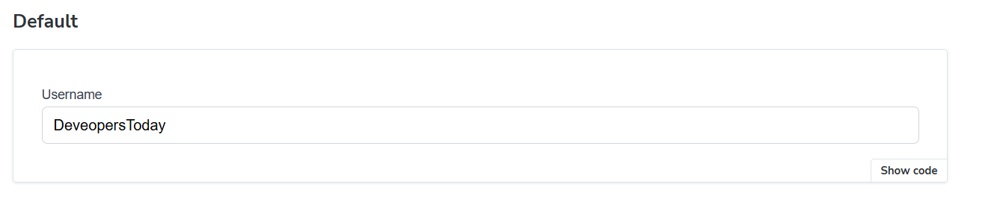
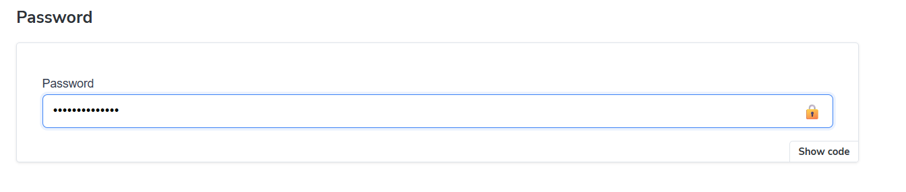
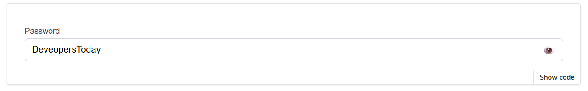
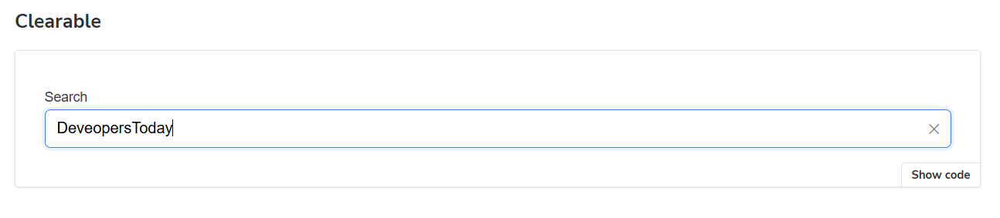
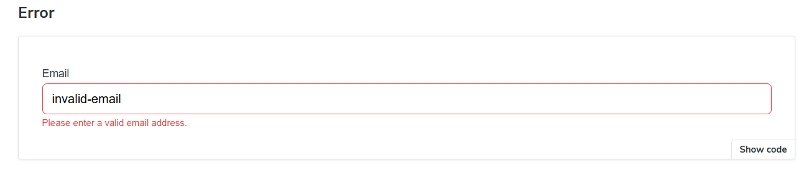
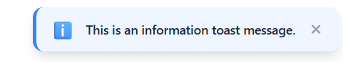
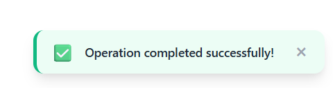
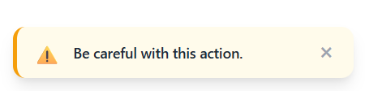
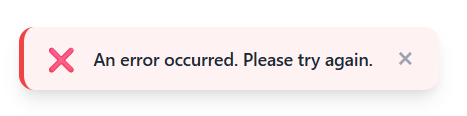
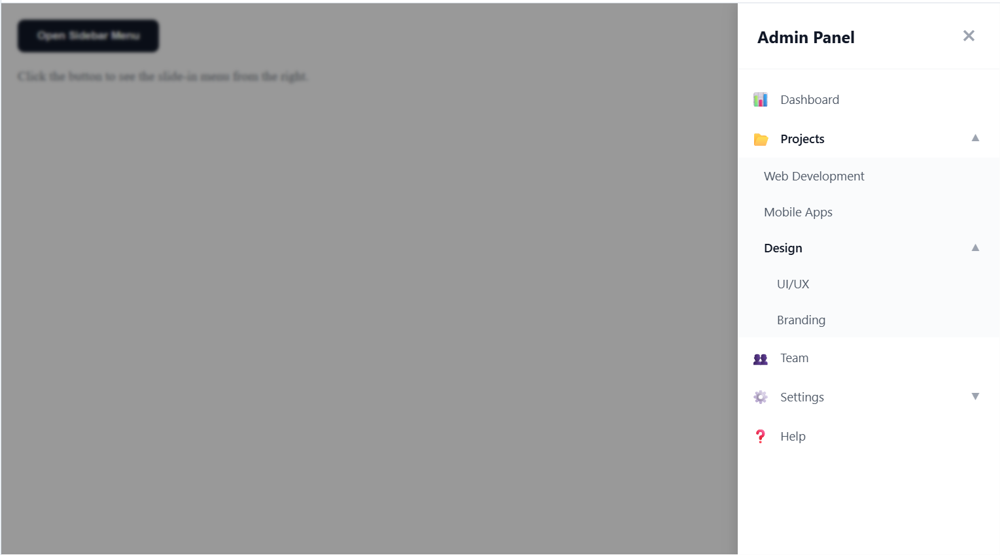

# React Component Library - Test Task

A small, high-quality React component library built with Storybook and TypeScript.

## 🚀 Getting Started

### Prerequisites
- Node.js (v18+)
- npm

### Installation
1. Clone the repository:
   ```bash
   git clone https://github.com/Oleksandr1212/test-task-DevelopersToday.git
   cd test-task-DevelopersToday
   ```
2. Install dependencies:
   ```bash
   npm install
   ```

### Running Storybook
To view and interact with the components:
```bash
npm run storybook
```
Storybook will open at `http://localhost:6006`.

## 🧩 Components

### 1. Input Component
A smart input field with support for:
- **Types**: text, password, number, email.
- **Passowrd Toggle**: Show/hide password visibility.
- **Clearable**: Quick "X" button to clear the input value.
- **Validation**: Error states and messages.

---

## ⚙️ Development Guidelines

- **TypeScript**: Strictly typed components.
- **CSS**: Vanilla CSS for styling (premium feel with custom animations).
- **ESLint/Prettier**: Code quality and consistent formatting are enforced.
- **Storybook**: Each component has a `.stories.tsx` file for documentation and testing.

---

## 📸 Screenshots

1. **Input - Default & Number States**:
   - Default:  (empty or with text)
   - Number:  (with numeric type)
2. **Input - Password States** (security and visibility):
   - Hidden:  (standard password mask)
   - Visible:  (after clicking the eye icon)
3. **Input - Clearable & Error States**:
   - Clearable:  (with clear "X" button)
   - Error:  (with validation feedback)
4. **Storybook UI**:
    (general view of the development environment)

### 2. Toast Component
A notification system with animations and auto-dismiss:

1. **Toast - Info & Success States**:
   - Info:  (standard notification)
   - Success:  (positive feedback)
2. **Toast - Warning & Error States**:
   - Warning:  (alert message)
   - Error:  (failure notification)
3. **Animations**: Smooth fade/slide using Framer Motion.

### 3. Sidebar Menu Component
A responsive slide-out menu with nested item support:

1. **Menu - Nested Levels**:
    (showing expanded categories and nested items)
2. **Features**:
   - Slide-in from right animation.
   - Backdrop with blur effect.
   - Recursive nesting support.
   - Click-to-close on backdrop or close button.

---

## 🎁 Bonus Features

### React Hook Form Integration
We've integrated `react-hook-form` to demonstrate how the `Input` component can be used in real-world form scenarios.

1. **RHF Example**:
    (interactive form with validation)

